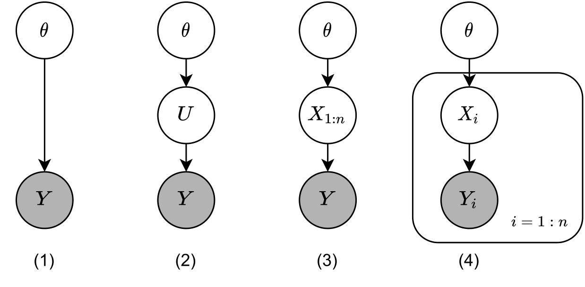

*   **Principle investigator:** Sinan Yıldırım
*   **Project Type:** TUBITAK 3501
*   **People:**  [See people working on the project](./another-page.html).

### Research output 

*   **Submitted:** Statistic Selection and MCMC for Differentially Private Bayesian Estimation, B.Alparslan, S.Yıldırım, submitted to Statistics and Computing, 2022
*   **Work in progress:** Differentially Private Linear Regression with Gibbs Sampling, B.Alparslan, S.Yıldırım, 2022

## Summary of the work

> **Title:** Statistic Selection and MCMC for Differentially Private Bayesian Estimation
>
> **Arxiv link:** https://arxiv.org/abs/2203.13377
>
> Differentially private Bayesian estimation of the parameters of a population distribution when a noisy statistic of a sample from that population is shared.

### Main contributions

* Statistic selection based on Fisher Information.
* Sampling from the true posterior based on the noisy statistic (Bayesian Inference using MCMC).

This work mainly addresses two problems: (1) What statistic of the sample should be shared privately? For the first question, i.e., the one about statistic selection, we promote using the Fisher information. We find out that, the statistic that is most informative in a non-privacy setting may not be the optimal choice under the privacy restrictions. We provide several examples to support that point. We consider several types of data sharing settings and propose several Monte Carlo-based numerical estimation methods for calculating the Fisher information for those settings. The second question concerns inference: (2) Based on the shared statistics, how could we perform effective Bayesian inference? We propose several Markov chain Monte Carlo (MCMC) algorithms for sampling from the posterior distribution of the parameter given the noisy statistic.

#### Statistic selection based on Fisher Information

| Model         | Type                                                                         | 
|:--------------|:-----------------------------------------------------------------------------|
| (1)           | Additive statistic, Gaussian noise                                           | 
| (2)           | Additive statistic, Non-Gaussian noise (Laplace)                             | 
| (3)           | Non-additive statistic, Non-Gaussian noise (Laplace)                         |
| (4)           | No summary statistic instead sequential release, Non-Gaussian noise (Laplace)| 

#### Bayesian Inference using MCMC

MCMC algorithms used in the project:

* Metropolis-Hastings (MH)
* Pseudo-Marginal Metropolis-Hastings (PMMH)
* Metropolis-Hastings with Averaged Acceptance Ratios (MHAAR)

| Model         | Algorithm                                                                         | 
|:--------------|:----------------------------------------------------------------------------------|
| Additive statistic, Gaussian noise                                           |  MH (Algorithm 4)  | 
| Additive statistic, Non-Gaussian noise (Laplace)                             |PMMH (Algorithm 5), MHAAR (Algorithm 6| 
| Non-additive statistic, Non-Gaussian noise (Laplace)                         |MHAAR (Algorithm 7)|
| No summary statistic instead sequential release, Non-Gaussian noise (Laplace)|MHAAR (Algorithm 8)| 